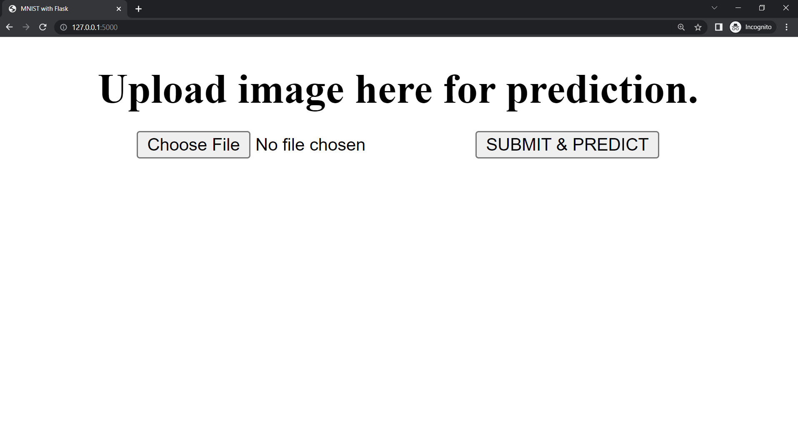
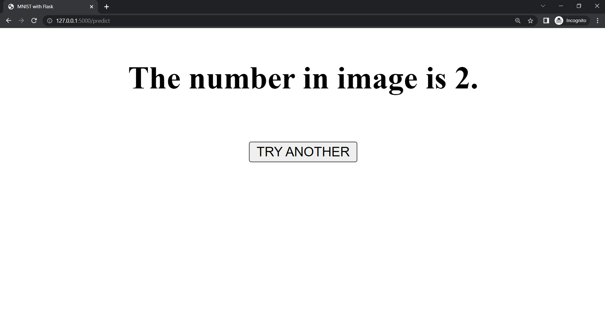

MNIST with Flask
-----------------

Mini web application for prediction of hand-written numbers.

In command prompt go to `MNIST-with-Flask` folder and run `flask run`.

Now go to browser and enter `http://127.0.0.1:5000` in URL.

Choose File from `sample-images` folder.

Here uploaded:

Got result:

